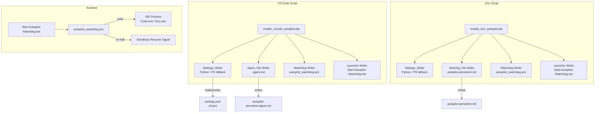

# Design Document: autopilot-enabler

## Overview

The autopilot-enabler is a pair of Windows batch scripts — `enable_vscode_autopilot.bat` and `enable_kiro_autopilot.bat` — that configure VS Code and Kiro IDE respectively for maximum autonomous agent operation. Each script orchestrates three concerns:

1. **Settings configuration** — merging required JSON keys into the IDE's settings file via a Python-primary / PowerShell-fallback writer component.
2. **Persistent instruction file** — writing an agent file (VS Code) or steering file (Kiro) that instructs the AI agent to never halt mid-task.
3. **Watchdog deployment** — writing a PowerShell background process that detects when the agent goes idle and automatically sends a resume signal.

Both scripts are fully idempotent: re-running them on an already-configured system produces no changes and reports all items as `ALREADY CORRECT` / `UP TO DATE`.

---

## Architecture



### Execution Flow

```
bat script starts
  │
  ├─ 1. Locate / create settings file
  ├─ 2. Backup settings file
  ├─ 3. Merge required keys (Python → PowerShell fallback)
  ├─ 4. Print per-key summary (ADDED / UPDATED / ALREADY CORRECT)
  ├─ 5. Write agent/steering file (overwrite if exists)
  ├─ 6. Write watchdog .ps1 (overwrite if exists)
  ├─ 7. Write launcher .bat (overwrite if exists)
  └─ 8. Print final summary (files touched, next steps)
```

---

## Components and Interfaces

### 2.1 `enable_vscode_autopilot.bat` — VS Code Entry Script

The top-level orchestrator for VS Code configuration. Implemented as a Windows batch file with embedded Python and PowerShell heredocs.

**Responsibilities:**
- Locate `settings.json` (stable path preferred over Insiders)
- Invoke Settings_Writer
- Write `autopilot-persistent.agent.md`
- Write `autopilot_watchdog.ps1` (VS Code variant)
- Write `Start-Autopilot-Watchdog.bat` launcher
- Check for GitHub Copilot extension and print free-tier guidance
- Print final summary

**Interface (command line):**
```
enable_vscode_autopilot.bat
```
No arguments. All configuration is embedded. Exit code 0 on success, non-zero on any unrecoverable error.

---

### 2.2 `enable_kiro_autopilot.bat` — Kiro Entry Script

Parallel orchestrator for Kiro IDE. Structurally identical to the VS Code script but targets Kiro-specific paths and file formats.

**Responsibilities:**
- Locate `cli.json` at the fixed Kiro path
- Invoke Settings_Writer
- Write `autopilot-persistent.md` (steering file)
- Write `autopilot_watchdog.ps1` (Kiro variant)
- Write `Start-Autopilot-Watchdog.bat` launcher
- Print final summary

**Interface (command line):**
```
enable_kiro_autopilot.bat
```
No arguments. Exit code 0 on success, non-zero on any unrecoverable error.

---

### 2.3 Settings_Writer

A JSON merge component embedded in each bat script as a Python script written to `%TEMP%\autopilot_setup.py` at runtime, then executed. If Python is unavailable, the bat script falls back to an inline PowerShell one-liner.

**Python implementation interface:**
```python
def merge_settings(settings_path: str, required_keys: dict) -> dict:
    """
    Reads existing JSON from settings_path, merges required_keys into it,
    writes the result back, and returns a change report.

    Returns: { key: "ADDED" | "UPDATED" | "ALREADY CORRECT" }
    Raises: FileNotFoundError, json.JSONDecodeError, PermissionError
    """
```

**PowerShell fallback interface:**
```powershell
# Inline one-liner invoked via: powershell -NoProfile -Command "..."
# Uses Add-Member -Force to upsert each required key
# Reads with ConvertFrom-Json, writes with ConvertTo-Json -Depth 10
```

**Backup contract:**
- Before any write, copy `<file>` → `<file>.pre-autopilot.bak` in the same directory.
- If the backup copy fails (e.g., disk full, permissions), abort immediately — do not write the modified settings.
- If the settings file contains malformed JSON, do not create the backup; log the error and exit non-zero.

**Change classification logic:**
```
for each required key K with required value V:
    if K not in existing_settings:
        status[K] = "ADDED"
    elif existing_settings[K] != V:
        status[K] = "UPDATED"
    else:
        status[K] = "ALREADY CORRECT"
```

---

### 2.4 VS Code Watchdog (`autopilot_watchdog.ps1`)

A PowerShell script deployed to `%USERPROFILE%\.copilot\autopilot_watchdog.ps1`. Runs as a long-lived background process in its own PowerShell window.

**Configurable parameters (top of script):**
| Parameter | Default | Valid Range | Description |
|---|---|---|---|
| `$checkInterval` | 8 | 1–60 s | Polling interval |
| `$idleThreshold` | 25 | 10–300 s | Seconds of unchanged title before halt is declared |
| `$cooldownPeriod` | 15 | 5–300 s | Post-resume wait before resuming normal polling |

**Halt detection algorithm:**
```
lastTitle = ""
lastActivityTime = now()

loop every $checkInterval seconds:
    proc = find process named "Code.exe" or "Code - Insiders.exe"
    if proc not found:
        log "[HH:mm:ss] VS Code not running. Waiting..."
        continue

    currentTitle = proc.MainWindowTitle
    if currentTitle != lastTitle:
        lastTitle = currentTitle
        lastActivityTime = now()

    idleSeconds = now() - lastActivityTime
    if idleSeconds >= $idleThreshold:
        declare HALT
        send resume signal
        sleep $cooldownPeriod
        lastActivityTime = now()   # reset after cooldown
```

**Resume signal delivery:**
1. Call `SetForegroundWindow(hwnd)` via P/Invoke
2. Sleep 300 ms
3. `SendKeys("^+i")` — open/focus chat panel (Ctrl+Shift+I)
4. Sleep 500 ms
5. `SendKeys("continue working on the remaining tasks")`
6. Sleep 200 ms
7. `SendKeys("{ENTER}")`

If `SetForegroundWindow` returns false or the window handle is 0, log the failure and skip the resume attempt without crashing.

**Logging format:**
```
  [HH:mm:ss] HALT DETECTED — idle Xs. Sending resume #N...
  [HH:mm:ss] Resume sent successfully.
  [HH:mm:ss] VS Code not running. Waiting...
  [HH:mm:ss] Active. Idle: Xs / Ys threshold
```

---

### 2.5 Kiro Watchdog (`autopilot_watchdog.ps1`)

Structurally identical to the VS Code watchdog. Differences:

- Monitors `Kiro.exe` instead of `Code.exe` / `Code - Insiders.exe`
- Deployed to `%USERPROFILE%\.kiro\autopilot_watchdog.ps1`
- Launcher deployed to `%USERPROFILE%\.kiro\Start-Autopilot-Watchdog.bat`

All configurable parameters, halt detection logic, resume signal delivery, and logging format are identical to the VS Code watchdog.

---

### 2.6 VS Code Agent File (`autopilot-persistent.agent.md`)

A Markdown file with YAML front-matter deployed to `%USERPROFILE%\.copilot\agents\autopilot-persistent.agent.md`.

**Front-matter schema:**
```yaml
---
name: Autopilot Persistent
description: Autonomous agent that never halts — completes all queued tasks without stopping.
tools:
  - '*'
---
```

The `tools: ['*']` wildcard grants permission for all built-in tools without per-tool approval prompts.

**Required body content:**
- Directive to never pause for user confirmation
- Auto-retry protocol: up to 5 retries before reporting failure
- Sequential task queue processing: only signal completion after all tasks are done
- Error recovery protocol with `[ERROR]`, `[SKIP]` log markers

---

### 2.7 Kiro Steering File (`autopilot-persistent.md`)

A Markdown file deployed to `%USERPROFILE%\.kiro\steering\autopilot-persistent.md`, encoded UTF-8.

**Front-matter schema:**
```yaml
---
inclusion: always
---
```

The `inclusion: always` directive causes Kiro to load this file in every session.

**Required body content:**
- Directive to operate in Autopilot_Mode and never pause for confirmation
- Auto-retry protocol: up to 5 retries with a 3-second delay between retries
- Sequential task queue processing: only signal completion after all tasks are done

---

## Data Models

### 3.1 VS Code Settings Keys

The Settings_Writer merges exactly these keys into `settings.json`:

```json
{
    "chat.autopilot.enabled": true,
    "chat.agent.enabled": true,
    "github.copilot.chat.agent.enabled": true,
    "chat.agent.maxRequests": 500,
    "chat.commandCenter.enabled": true,
    "github.copilot.chat.tools.terminal.autoApprove": true,
    "chat.tools.autoApprove": true,
    "chat.agent.autoApproveTools": true
}
```

### 3.2 Kiro Settings Keys

The Settings_Writer merges exactly these keys into `cli.json`:

```json
{
    "autoApprove": true,
    "supervisedMode": false
}
```

### 3.3 Change Report

The in-memory change report produced by the Settings_Writer:

```python
{
    "chat.autopilot.enabled": "ADDED" | "UPDATED" | "ALREADY CORRECT",
    # ... one entry per required key
}
```

### 3.4 File Layout

```
%USERPROFILE%\
├── .copilot\
│   ├── agents\
│   │   └── autopilot-persistent.agent.md       # VS Code agent file
│   ├── autopilot_watchdog.ps1                  # VS Code watchdog
│   └── Start-Autopilot-Watchdog.bat            # VS Code watchdog launcher
│
└── .kiro\
    ├── settings\
    │   ├── cli.json                             # Kiro settings (modified in-place)
    │   └── cli.json.pre-autopilot.bak           # Backup (created before modification)
    ├── steering\
    │   └── autopilot-persistent.md             # Kiro steering file
    ├── autopilot_watchdog.ps1                  # Kiro watchdog
    └── Start-Autopilot-Watchdog.bat            # Kiro watchdog launcher

%APPDATA%\
└── Code\
    └── User\
        ├── settings.json                        # VS Code settings (modified in-place)
        └── settings.json.pre-autopilot.bak      # Backup (created before modification)
```

---

## Correctness Properties

*A property is a characteristic or behavior that should hold true across all valid executions of a system — essentially, a formal statement about what the system should do. Properties serve as the bridge between human-readable specifications and machine-verifiable correctness guarantees.*

### Property 1: Settings merge preserves existing keys

*For any* existing JSON settings object and any set of required key-value pairs, after the Settings_Writer merges the required pairs, all keys that were present in the original object and are not in the required set SHALL still be present with their original values.

**Validates: Requirements 1.4, 1.5, 5.4, 5.5, 9.1, 9.2**

---

### Property 2: Settings merge sets all required keys to required values

*For any* existing JSON settings object (including an empty object), after the Settings_Writer merges the required key-value pairs, every required key SHALL be present in the result with exactly the required value.

**Validates: Requirements 1.4, 5.4, 9.1, 9.2**

---

### Property 3: Change report correctly classifies every key

*For any* existing JSON settings object and any required key-value set, the change report produced by the Settings_Writer SHALL classify each required key as `ADDED` if the key was absent, `UPDATED` if the key was present with a different value, and `ALREADY CORRECT` if the key was present with the required value — with no misclassifications.

**Validates: Requirements 1.6, 5.7, 9.5**

---

### Property 4: VS Code path resolution priority

*For any* combination of which candidate settings paths exist on disk (stable only, insiders only, both, neither), the Settings_Writer SHALL select the stable path (`%APPDATA%\Code\User\settings.json`) when it exists, the insiders path when only it exists, and create the stable path when neither exists.

**Validates: Requirements 1.1, 1.2**

---

### Property 5: Watchdog halt detection threshold

*For any* sequence of window title samples with associated timestamps, the watchdog SHALL declare a halt if and only if the title has remained unchanged for a continuous duration greater than or equal to `$idleThreshold` seconds, and SHALL NOT declare a halt if the title changed within that window.

**Validates: Requirements 4.3, 7.4**

---

### Property 6: Watchdog log entries contain valid timestamps

*For any* watchdog event (halt detected, resume sent, process not found, active heartbeat), the log line emitted SHALL contain a timestamp matching the pattern `HH:mm:ss` where HH is 00–23, mm is 00–59, and ss is 00–59.

**Validates: Requirements 4.7, 7.8**

---

### Property 7: Watchdog configurable parameters are range-validated

*For any* value of `$checkInterval` in [1, 60] and `$cooldownPeriod` in [5, 300], the watchdog SHALL accept the configuration and operate with those values; values outside these ranges SHALL be rejected or clamped to the nearest boundary.

**Validates: Requirements 4.2, 4.6, 7.2, 7.7**

---

### Property 8: Second run produces no modifications

*For any* system state where both scripts have been run once and no external changes have been made to the target files, running either script a second time SHALL result in zero file modifications, and the summary SHALL report every key as `ALREADY CORRECT` and every file as `UP TO DATE`.

**Validates: Requirements 9.1, 9.2, 9.3, 9.4, 9.5**

---

## Error Handling

### 6.1 Settings_Writer Error Matrix

| Condition | Behavior | Exit Code |
|---|---|---|
| Python unavailable | Silent fallback to PowerShell | — (continues) |
| Python and PowerShell both unavailable | Print error identifying missing deps | Non-zero |
| Backup creation fails | Abort; do not modify original file | Non-zero |
| Settings file contains malformed JSON | Log parse error; do not create backup; do not modify | Non-zero |
| Settings file does not exist | Create parent directories and file, then proceed | 0 |
| Settings file exists and is valid | Merge keys, write, print summary | 0 |

### 6.2 Watchdog Error Matrix

| Condition | Behavior |
|---|---|
| IDE process not found | Log waiting message; continue polling |
| IDE process not found for 360+ consecutive cycles (~30 min) | Log timeout warning; continue polling indefinitely |
| `SetForegroundWindow` fails | Log failure with timestamp; skip resume attempt; continue polling |
| Window handle is 0 | Same as `SetForegroundWindow` failure |
| Unexpected PowerShell exception | Log exception; continue polling (do not crash) |

### 6.3 Script-Level Error Handling

Both bat scripts use `setlocal enabledelayedexpansion` and check exit codes after each major step. The final summary section always executes (even after errors) and lists:

- (a) Each file created or modified with its full path
- (b) Each file that failed to be created or modified with the reason
- (c) Next steps the user must take to activate the configured setup

---

## Testing Strategy

### 7.1 Approach

This feature is a set of scripts that perform file I/O, process detection, and keyboard automation. The core logic amenable to automated testing is the **Settings_Writer merge logic** (a pure function over JSON objects) and the **watchdog halt detection logic** (a pure function over title sequences and timestamps). These are tested with property-based tests.

UI automation (SendKeys), process detection, and file system side effects are tested with example-based unit tests using mocks.

### 7.2 Property-Based Tests

Property-based testing is applied to the Settings_Writer and watchdog logic. The recommended library is **Hypothesis** (Python) for the Settings_Writer and **Pester** with a custom generator for the watchdog PowerShell logic.

Each property test runs a minimum of **100 iterations**.

**Tag format:** `Feature: autopilot-enabler, Property {N}: {property_text}`

| Property | Test | Library |
|---|---|---|
| Property 1: Settings merge preserves existing keys | Generate random JSON objects + required key sets; verify no original key is lost | Hypothesis |
| Property 2: Settings merge sets all required keys | Generate random JSON objects; verify all required keys have required values after merge | Hypothesis |
| Property 3: Change report classification | Generate random JSON objects with varying key presence/values; verify classification is correct for every key | Hypothesis |
| Property 4: VS Code path resolution priority | Enumerate all 4 combinations of path existence; verify correct path selected | Hypothesis (parametric) |
| Property 5: Watchdog halt detection threshold | Generate random title sequences with timestamps; verify halt declared iff idle >= threshold | Hypothesis |
| Property 6: Watchdog log timestamp format | Generate random watchdog events; verify log lines match HH:mm:ss pattern | Hypothesis |
| Property 7: Watchdog parameter range validation | Generate random interval/cooldown values; verify acceptance/rejection at boundaries | Hypothesis |
| Property 8: Second run idempotency | Run merge twice on same object; verify second run produces no changes | Hypothesis |

### 7.3 Example-Based Unit Tests

| Scenario | Test |
|---|---|
| Backup creation failure aborts write | Mock `shutil.copy2` to raise `PermissionError`; verify original file unchanged |
| Malformed JSON skips backup and modification | Pass truncated JSON string; verify no backup file, no write, non-zero exit |
| Python unavailable falls back to PowerShell | Mock `python` as not found; verify PowerShell fallback is invoked |
| Both Python and PowerShell unavailable | Mock both as not found; verify error message and non-zero exit |
| Agent file overwritten without prompt | Pre-create agent file with different content; run script; verify new content |
| Steering file overwritten without prompt | Same as above for Kiro steering file |
| Watchdog launcher contains correct invocation | Read launcher bat; verify it contains `-ExecutionPolicy Bypass` and correct `.ps1` path |
| Copilot extension installed → INSTALLED status | Mock `code --list-extensions` to include `GitHub.copilot`; verify status line |
| Copilot extension not installed → instructions printed | Mock extension list without Copilot; verify installation instructions in output |
| Watchdog: process not found → waiting message | Mock `Get-Process` to return nothing; verify log message and no crash |
| Watchdog: `SetForegroundWindow` fails → log and skip | Mock P/Invoke to return false; verify log message and no resume sent |

### 7.4 Integration Tests

Run against a real (or sandboxed) filesystem:

- Full VS Code script execution on a clean system (no settings.json)
- Full VS Code script execution on a system with existing settings.json
- Full Kiro script execution on a clean system
- Full Kiro script execution on a system with existing cli.json
- Re-run of each script verifies idempotency (all ALREADY CORRECT)

### 7.5 Test File Locations

```
tests/
├── test_settings_writer.py      # Hypothesis property tests + unit tests for merge logic
├── test_watchdog_logic.py       # Hypothesis property tests for halt detection
└── test_integration.ps1         # Pester integration tests (sandboxed filesystem)
```
